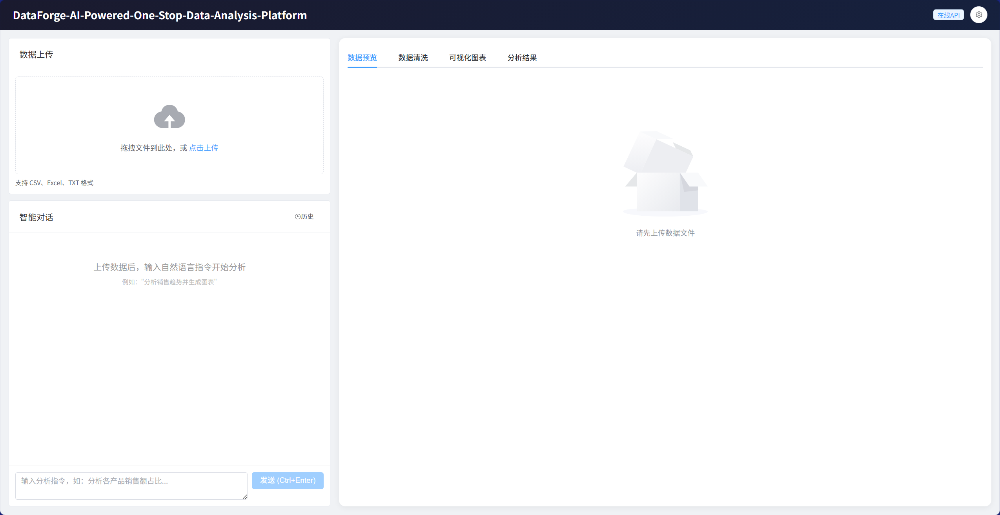
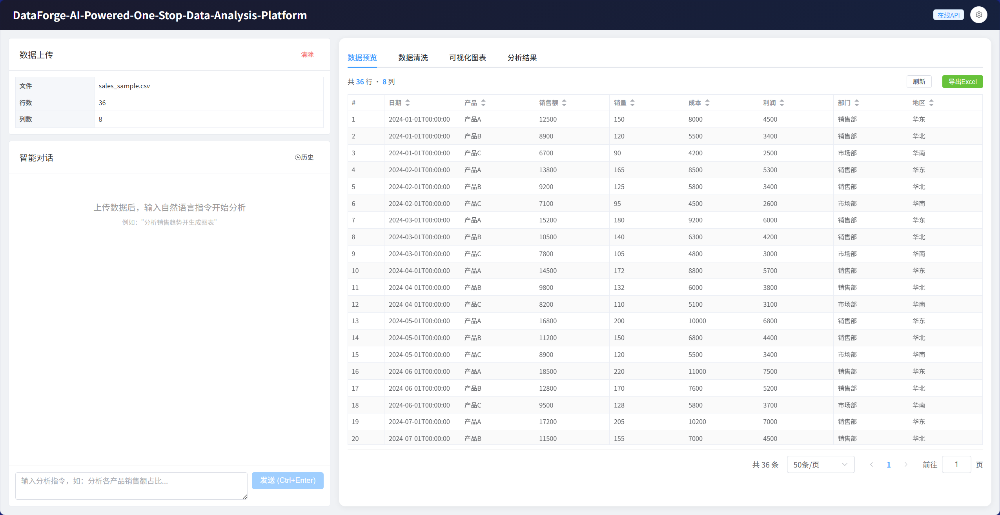
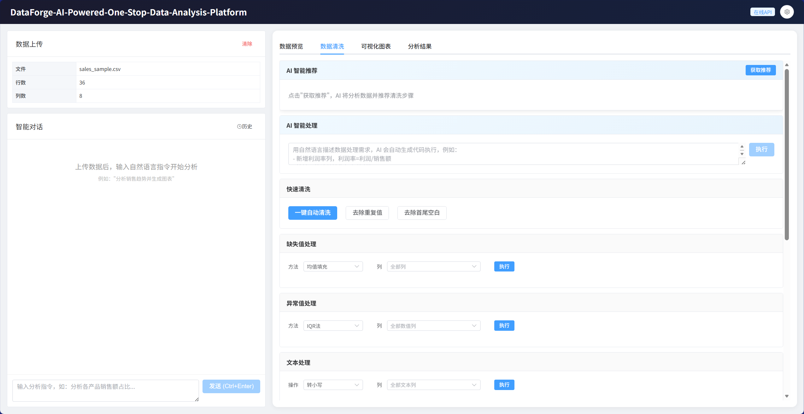
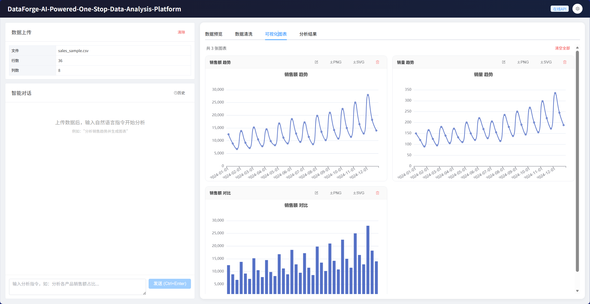
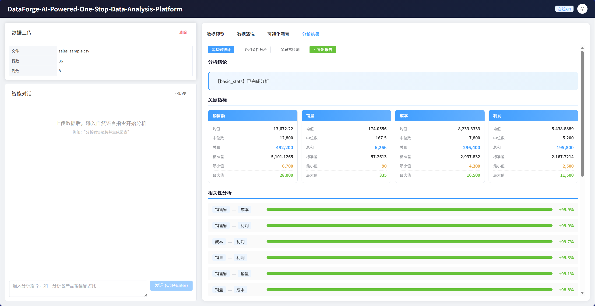

# DataForge-AI-Powered-One-Stop-Data-Analysis-Platform

An AI-powered data analysis platform that turns natural language into insights. Upload your data, ask questions in plain language, and get visualizations, statistics, and reports — no code required.

[](https://python.org)
[](https://vuejs.org)
[](https://fastapi.tiangolo.com)
[](LICENSE)

## Screenshots

### Homepage



### Data Preview



### Data Cleaning



### Visualization



### Analysis Results



## Features

### Conversational Data Analysis
- Natural language interface — ask questions about your data in plain English (or Chinese)
- LLM Agent automatically selects the right tools: statistics, charts, cleaning, summarization
- Streaming responses (SSE) with real-time tool execution status
- Context-aware — the AI knows your column names, data types, and sample values
- 10-round conversation memory for follow-up questions

### AI-Powered Data Cleaning
- **Auto-recommend**: AI analyzes data quality and suggests cleaning steps with explanations
- **Natural language cleaning**: describe what you want in plain language
- **Advanced transforms**: AI generates pandas code executed in a sandboxed environment — calculated columns, groupby, conditional logic, pivots, and more
- 20+ built-in operations: fill missing (7 methods), remove duplicates, detect outliers (IQR/Z-score), trim whitespace, type conversion, datetime truncation, column rename/drop, conditional row filtering

### Smart Visualization
10 chart types with automatic recommendation based on data characteristics:

| Type | Use Case |
|------|----------|
| Line | Time series trends |
| Bar | Category comparisons |
| Pie | Proportions |
| Scatter | Correlations |
| Heatmap | Correlation matrices |
| Box | Distribution analysis |
| Area | Cumulative trends |
| Radar | Multi-dimensional profiles |
| China Map | Provincial data |
| World Map | Country-level data |

- Auto-detects geographic columns and generates maps
- Built-in chart editor: change title, type, and color theme (5 palettes)
- Export as PNG (2x resolution) or SVG

### Built-in Analytics
- Basic statistics (mean, median, std, quartiles, min/max, sum)
- Correlation analysis (Pearson matrix, top pairs)
- Anomaly detection (IQR method)
- Trend analysis (moving averages, growth rates)
- Distribution analysis (histogram, skewness, kurtosis)
- Year-over-year and month-over-month comparisons

### Export
- Data: Excel (.xlsx), CSV (UTF-8 with BOM)
- Charts: PNG, SVG, interactive HTML
- Reports: full HTML report with data overview, key findings, statistics table, charts, and conversation history

### Session Management
- Persistent conversation history stored in SQLite
- Switch between sessions to compare analyses
- Upload different datasets in isolated sessions

## Tech Stack

| Layer | Technology |
|-------|------------|
| Backend | FastAPI, Pandas, NumPy, SciPy, Plotly |
| Frontend | Vue 3, Element Plus, ECharts, Pinia |
| AI | OpenAI-compatible API (DeepSeek, Qwen, Zhipu) or Ollama for local models |
| Communication | SSE streaming, REST API |
| Storage | SQLite via aiosqlite |

## Getting Started

### Prerequisites

- Python 3.10+
- Node.js 18+
- An LLM API key (DeepSeek, OpenAI, Qwen, etc.) or Ollama installed locally

### Backend Setup

```bash
cd backend

# Create virtual environment
python -m venv venv
source venv/bin/activate  # Windows: venv\Scripts\activate

# Install dependencies
pip install -r requirements.txt

# Configure environment
cp .env.example .env
# Edit .env with your API key and model settings
```

**.env configuration:**

```env
# LLM provider: "openai" or "ollama"
LLM_PROVIDER=openai

# OpenAI-compatible API
OPENAI_API_KEY=sk-your-key-here
OPENAI_BASE_URL=https://api.deepseek.com/v1
OPENAI_MODEL=deepseek-chat

# Or use Ollama locally
OLLAMA_BASE_URL=http://localhost:11434
OLLAMA_MODEL=qwen2.5:7b
```

```bash
# Start the server
uvicorn app.main:app --reload --port 8000
```

### Frontend Setup

```bash
cd frontend

# Install dependencies
npm install

# Start dev server
npm run dev
```

The app will be available at `http://localhost:3000`.

### Production Build

```bash
cd frontend
npm run build
```

The built files in `frontend/dist/` can be served by any static file server, or reverse-proxied through Nginx alongside the backend.

## Project Structure

```
.
├── backend/
│   ├── app/
│   │   ├── api/                # API endpoints
│   │   │   ├── data.py         # Upload, preview, pagination
│   │   │   ├── chat.py         # Conversational AI (SSE streaming)
│   │   │   ├── cleaning.py     # Data cleaning & AI transforms
│   │   │   ├── analysis.py     # Statistical analysis
│   │   │   ├── visualization.py # Chart generation
│   │   │   ├── export.py       # Excel/CSV/PNG/HTML export
│   │   │   └── history.py      # Session management
│   │   ├── core/
│   │   │   ├── agent.py        # LLM Agent with tool calling
│   │   │   ├── prompts.py      # System prompts & tool definitions
│   │   │   ├── llm_client.py   # OpenAI / Ollama client abstraction
│   │   │   └── database.py     # SQLite persistence
│   │   ├── services/
│   │   │   ├── data_processor.py # Data cleaning operations
│   │   │   ├── analyzer.py     # Statistical analysis engine
│   │   │   └── visualizer.py   # Plotly chart generation
│   │   ├── config.py           # Settings from .env
│   │   └── main.py             # FastAPI app entry point
│   ├── requirements.txt
│   └── .env.example
└── frontend/
    ├── src/
    │   ├── components/
    │   │   ├── DataUpload.vue    # File upload with drag & drop
    │   │   ├── DataPreview.vue   # Paginated data table
    │   │   ├── DataCleaning.vue  # Cleaning controls & AI input
    │   │   ├── ChartView.vue     # ECharts rendering & editing
    │   │   ├── AnalysisResult.vue # Analysis cards & charts
    │   │   ├── ChatPanel.vue     # Conversational AI interface
    │   │   └── SettingsPanel.vue # LLM configuration
    │   ├── stores/app.js         # Pinia state management
    │   ├── api/index.js          # Axios API layer
    │   └── App.vue               # Main layout
    ├── package.json
    └── vite.config.js
```

## API Overview

| Endpoint | Method | Description |
|----------|--------|-------------|
| `/api/data/upload` | POST | Upload CSV/Excel/TXT file |
| `/api/data/preview` | GET | Get data preview |
| `/api/data/page` | GET | Paginated data |
| `/api/chat/stream` | POST | AI chat with SSE streaming |
| `/api/cleaning/auto` | POST | Auto-clean (dedup + fill) |
| `/api/cleaning/recommend` | POST | AI-recommended cleaning steps |
| `/api/cleaning/ai-clean` | POST | Natural language cleaning |
| `/api/cleaning/ai-transform` | POST | AI-generated pandas code |
| `/api/analysis/run` | POST | Run statistical analysis |
| `/api/visualization/generate` | POST | Generate a chart |
| `/api/visualization/auto` | GET | Auto-generate charts |
| `/api/export/data` | POST | Export data as Excel/CSV |
| `/api/export/report` | POST | Export full HTML report |
| `/api/config` | GET/POST | Get/update LLM config |

## Supported LLM Providers

| Provider | Base URL | Example Models |
|----------|----------|----------------|
| DeepSeek | `https://api.deepseek.com/v1` | `deepseek-chat` |
| Qwen (Tongyi) | `https://dashscope.aliyuncs.com/compatible-mode/v1` | `qwen-plus` |
| Zhipu (GLM) | `https://open.bigmodel.cn/api/paas/v4` | `glm-4-flash` |
| OpenAI | `https://api.openai.com/v1` | `gpt-4o-mini` |
| Ollama (local) | `http://localhost:11434` | `qwen2.5:7b`, `llama3` |

## License

MIT
